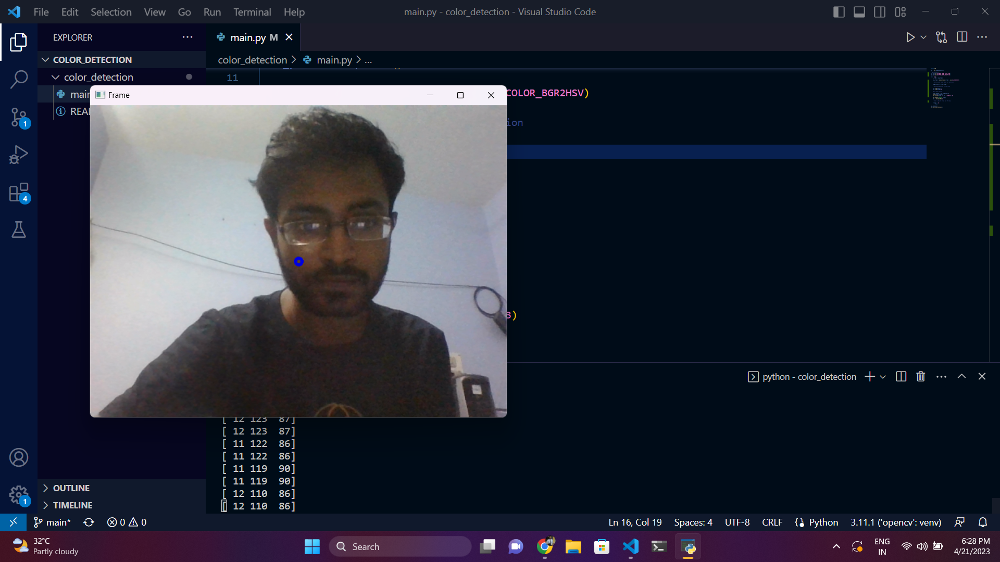

# Real Time Object Detection

## Requirements :

### Files :
Please download the following files and put them inside the code directory for the code to work :

[Files](https://drive.google.com/drive/folders/17vOxgYuEvam6Uq8i1iirIdT6FlPTJnsI?usp=sharing)

The link contains the following files :

* classes.txt (This file contains the different classes the YOLOv4-tiny model is able to detect)
* yolov4-tiny.cfg
* yolov4-tiny.weights

## Model :

The model used for the project is YOLOv4-tiny 

* [Arxiv](https://arxiv.org/abs/2004.10934)
* [Github](https://github.com/AlexeyAB/darknet/releases)

## Downloading the code 

``` git clone <repo link> ```

### Here is a demo image of the project :


